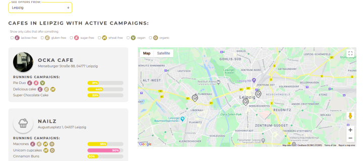
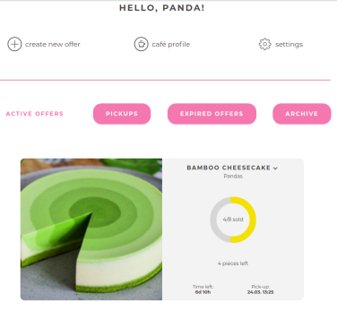
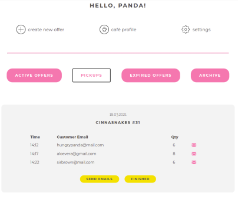
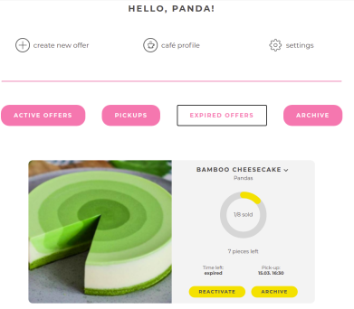

<h1></h1>

<h2 align="center" style="color: pink">Let them order cake!</h2>

Explore the [deployed version](https://bakey-app.herokuapp.com/)

## Introduction

### Origin of Bakey

Bakey was a vision of [Ola](https://github.com/OlaFro) for the final project together with [Alice](https://github.com/Alice-Rez) and [willoid](https://github.com/willoid) after [our](https://bakey-app.herokuapp.com/about-us) one year web development course at [DCI](https://digitalcareerinstitute.org/).

During the Covid19 lockdowns from 2020 and 2021 cafés weren't allowed to offer nothing but meals to-go. Many of them wouldn't even take the risk of producing meals that wouldn't find a buyer and would just remain closed. With Bakey cafés can easily publish campaigns to sell their cakes and meals in a crowdfunding system: they indicate how many portions they need to sell for the production to be profitable, then clients can buy portions and invite their friends to buy other portions. If the minimum goal is reached, cafés get the money to start baking and keep their business alive! 

### Development of Bakey

Take a look at our thorough [technical guidelines](./Technical-guidelines.md) to learn everything about the technologies applied during the development.

Bakey has been created from scratch in seven weeks between February and March 2021. Before starting coding, the functionalities were discussed and planned one by one in the different sprints. The Bakey team started coding in April 2020 as complete beginners and this web application is the result of most of the skills learned through an intense year marked by Covid19. We worked remotely and weren't able to meet even once. While [Ola](https://github.com/OlaFro) took over the role of product owner and front-end lead, [Alice](https://github.com/Alice-Rez) lead the back-end and the technological decisions but all three of us worked fullstack in this MERN project. 

### Navigating through Bakey

Please note that all products and functionalities are mockups, so please help us by entering also fake and open source data. You can navigate as a [client](#bakey-as-a-client) or as a [café owner](#bakey-as-a-café-owner). If you add or find data that is protected, write us a short message at bakeyapp@gmail.com to get it removed.

## Bakey as a client

- Start selecting one of the available cities from the [landing page](https://bakey-app.herokuapp.com/) or [register](https://bakey-app.herokuapp.com/registration/user).
- Check a list of the cafés with their offers or look at the map to find a café near a location you may have in mind. You can also use the filter to find options according your dietary restrictions. When you find a café, click on their card or on the pin in the map and you will get redirected to the café profile page.

- You will see all of the open campaigns, their progress and buy a piece or the rest of the cake. If you are not logged in, you will be redirected to the log in but don't be worried, your choice is saved and you will get redirected to your order summary after logging in.
- In the order confirmation you will still be able to modify your order and add more pieces to your order.
- Proceed to checkout with mockup payment data and then invite other friends to buy more portions so the campaign can be successful. 

## Bakey as a café owner

- Register [here](https://bakey-app.herokuapp.com/registration/cafe). You can enter fake data but the address must be real. We are working now with Hamburg, Düsseldorf and Leipzig but please feel free to try with another city. It will work!
- After logging in you will be redirected to your dashboard. In order to see something, you will have to create a new offer. You will need a picture smaller than 2MB and in a square format. You will see a preview of the offer before you click on save.
- The dashboard will be updated with your offer. 

- To see some progress log in as a client and buy some portions or the whole cake e.g. from a different browser. Click on pickups to see campaigns that were sold out and on expired offers to see the ones which weren't successful. You can complete the sold out orders by sending a fake confirmation to clients and clicking on finishing if you imagine that the clients picked up their portions. Finished orders will be stored in "archive".

- If you create an offer and it expires before it gets sold out, you will find it in expired offers. If you wish you can archive the order or reactivate it. Archived order can also be reactivated.

- To reactivate an expired or archive order, you will get to a pre-filled form where you only have to re-enter a new pick-up date. Of course you can modify any field you wish and can try to reprice it or change the pieces. 

- This application puts the cafés first. By clicking on settings, café owners have the chance to really make a nice profile and upload a cover photo (1200 x 400 px) and a logo (square format) and write a nice description. The button café profile in the dashboard redirects to the public profile of the café. Give it a try!

## You have something to say?

Please, write us. We want to know if you like it, tell you all about all the details, improve it and if the odds are good: make it real!

### Contact us on bakeyapp@gmail.com